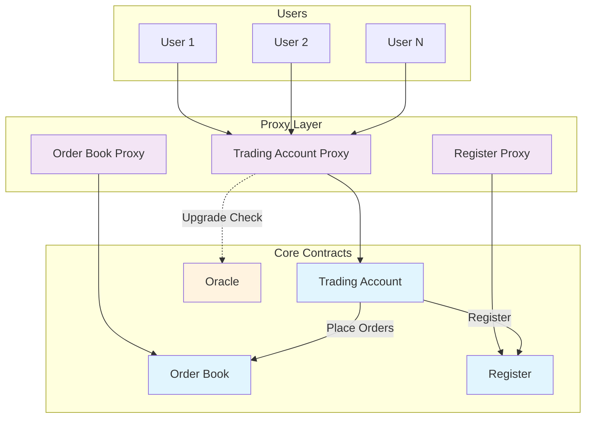
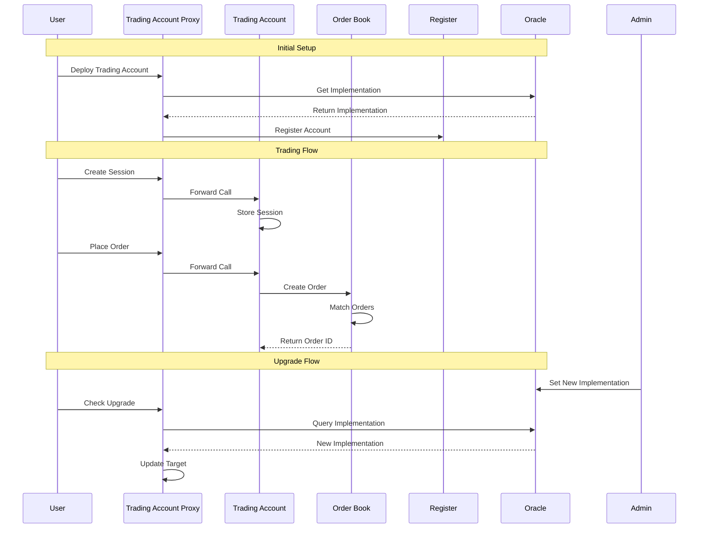
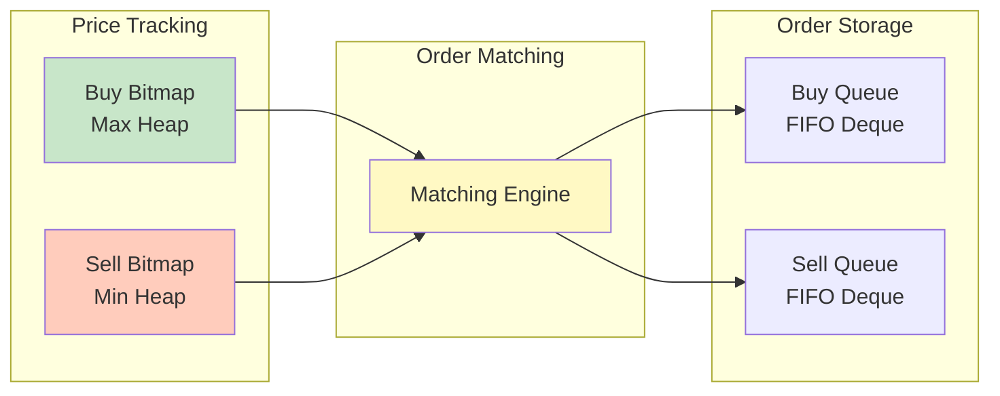
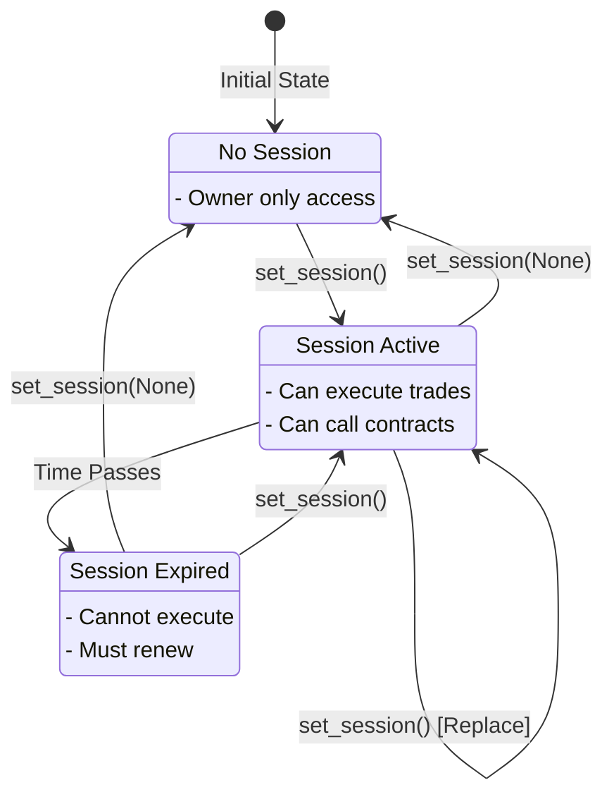
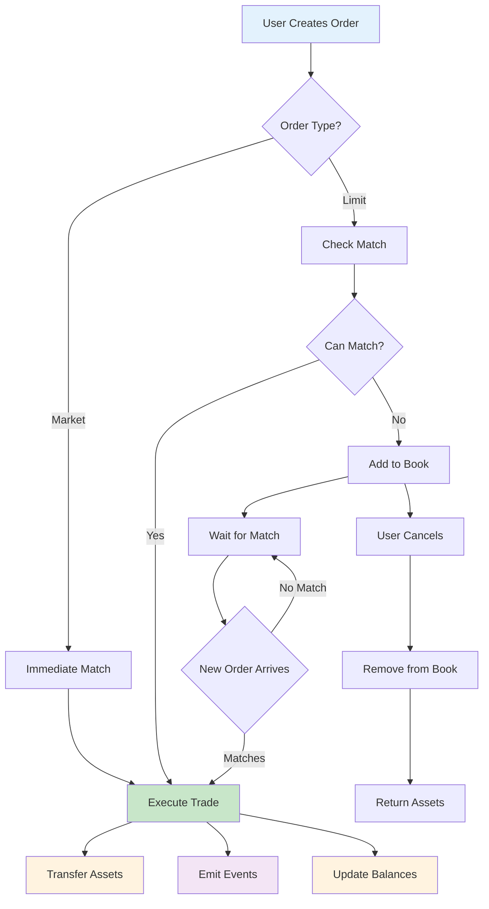

# Fuel O2 Protocol - Smart Contracts

## Overview

The O2 Protocol is a decentralized trading system built on the Fuel blockchain. It provides a complete infrastructure for on-chain trading with user-controlled accounts, order book management, and upgradeable contracts.

## Architecture



## Component Overview

### 1. Trading Account
Personal smart contract wallets for users with advanced trading capabilities.

**Key Features:**
- **Secure Asset Custody**: Owner-only withdrawals
- **Multi Signature Support**: EVM and Fuel personal signature supported
- **Session Management**: Delegated access for automated trading
- **Upgradeable**: Via proxy pattern with oracle validation
- **Multi-Asset Support**: Handle multiple token types

### 2. Order Book
Decentralized exchange contracts for specific trading pairs.

**Key Features:**
- **Limit Orders**: Support for Spot limit orders.
- **StopLimit Orders**: Not Supported (ATM)
- **MakertLimit Orders**: Not Supported (ATM)
- **Automatic Matching**: Price-time priority execution
- **Fee Management**: Configurable maker/taker fees
- **Price Discovery**: Best bid/ask prices

### 3. Register
Central registry for all protocol contracts.

**Key Features:**
- **Contract Discovery**: Find trading accounts and order books
- **One-to-One Mappings**: User → Trading Account, Market → Order Book
- **Paginated Queries**: Efficient retrieval of large datasets

### 4. Oracle
Trusted source for contract upgrades.

**Key Features:**
- **Upgrade Security**: Validates implementation changes
- **Admin Control**: Owner-managed upgrade approvals
- **Pausable**: Emergency stop functionality

## Contract Interactions



## Data Structures

### Order Book Storage



### Session Management



## Trading Flow

### Order Lifecycle



## Key Features

### 1. Proxy Pattern for Upgradeability
All main contracts implement upgradability through the use of blobs, instead of the old standard using underling contracts.
This creates a more effient way as the transaction does not need to include the contract input for the Implementation Contract.

Contracts that implement the standard:
- Trading Account
- OrderBook
- Register

### 2. Session Keys for Automation
Trading accounts support session keys for:
- Automated trading bots
- Reduced key exposure
- Time-limited permissions
- Replay protection via nonces

### 3. Efficient Order Matching
Order books use optimized data structures:
- **Bitmaps**: O(1) price level tracking
- **Heaps**: O(log n) best price discovery
- **Deques**: O(1) FIFO order processing

## Contract Deployment

### Prerequisites
- Fuel toolchain installed
- Forc package manager
- Rust for integration tests

### Building Contracts

```bash
# Build all from root folder
bun sway:build
```

or

```bash
# Build all from packages/sway-v2 folder
forc build --release
```

### Deployment Order

1. **Deploy Oracle**: Sets approved implementations
2. **Deploy Implementation Contracts**: Trading Account, Order Book, Register
3. **Deploy Proxies**: With oracle and initial implementations
4. **Initialize Contracts**: Set owners and initial parameters
5. **Register Contracts**: Add to central registry

## Security Considerations

### Access Control
- **Owner-only functions**: Critical operations restricted
- **Session validation**: Time-based and signature-based
- **Proxy ownership**: Transferable but protected

### Asset Safety
- **No intermediary custody**: Direct peer-to-peer trades
- **Atomic swaps**: All-or-nothing execution
- **Balance tracking**: Accurate accounting

### Upgrade Security
- **Oracle validation**: Centralized upgrade approval
- **Implementation verification**: Bytecode existence checks
- **Pausable contracts**: Emergency stop capability

## Testing

The protocol includes comprehensive test suites:

```bash
# Run all tests
cargo test

# Run specific contract tests
cd trade-account && cargo test
```

## Libraries

### Bitmap Library
Efficient price level tracking using 256-bit bitmaps with heap-based priority queues.

### Deque Library
Sparse double-ended queue for FIFO order management with O(1) operations.

### Heap Library
Generic min/max heap implementations for price discovery.

### Crypto Library
Signature verification supporting both Fuel and Ethereum addresses.

### Proxy Library
Low-level bytecode loading for proxy delegation.

## Events

All contracts emit comprehensive events for off-chain monitoring:

- **OrderCreatedEvent**: New order placed
- **OrderMatchedEvent**: Trade executed
- **OrderCancelledEvent**: Order removed
- **SessionCreatedEvent**: New session established
- **WithdrawEvent**: Assets withdrawn
- **TradeAccountRegistered**: Account registered
- **OrderBookRegistered**: Market registered

## Configuration

### Order Book Configruables
- `BASE_ASSET`: Base trading asset
- `QUOTE_ASSET`: Quote pricing asset
- `MIN_BASE_TRADE`: Minimum base amount
- `MIN_QUOTE_TRADE`: Minimum quote amount
- `MAKER_FEE`: Fee for liquidity providers
- `TAKER_FEE`: Fee for liquidity takers
- `BASE_DECIMALS`: Base asset precision
- `QUOTE_DECIMALS`: Quote asset precision

### Trade Account Configruables
- `ORACLE_CONTRACT_ID`: Oracle Contract Id used to query the verified blob versions.
- `INITIAL_OWNER`: The address of the Account that will have admin access to the TradeAccount.


### Dependencies
- **ownership**: Access control and ownership management
- **pausable**: Emergency pause functionality
- **src5**: State management standards
- **upgradability**: Proxy upgrade mechanisms
